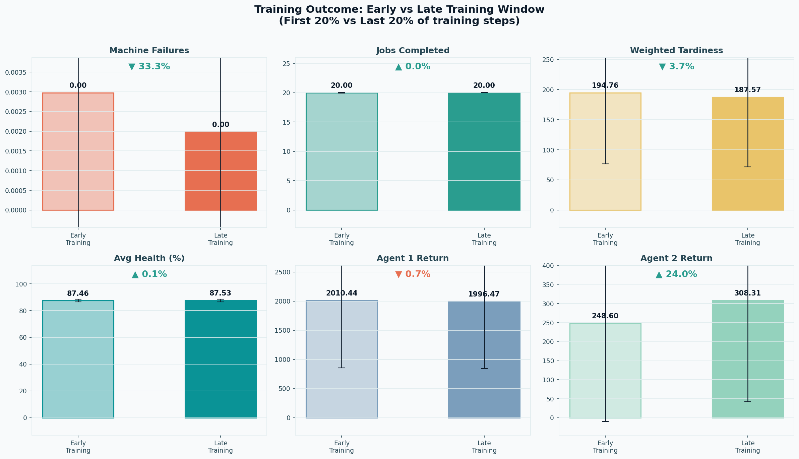
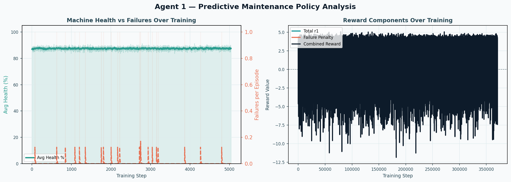
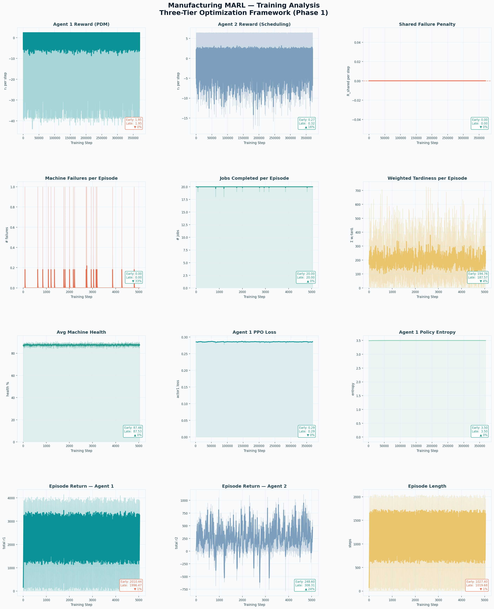

<div align="center">

# Three-Tier Manufacturing Optimization Framework

### Integrated Predictive Maintenance · Job Shop Scheduling · Resource Allocation
### using Multi-Agent Reinforcement Learning

**MCD412: BTP2 — IIT Delhi, Department of Mechanical Engineering**

Shreenath Jha (2022ME11306) · Kirtan Gehlot (2022ME12030)

*Supervisor: Dr. Minakshi Kumari*

---


</div>

---

## Overview

Modern manufacturing systems face a critical challenge: **predictive maintenance**, **job shop scheduling**, and **resource allocation** are traditionally solved as separate problems. Independent decisions lead to machines going down mid-operation, maintenance competing with production for the same resources, and schedules that ignore machine health entirely.

This project develops a **Three-Tier Cascade Framework** that solves all three simultaneously:

- **Tier 1 — Exact Optimization:** Google OR-Tools CP-SAT solver with 38 constraints across 5 constraint groups, yielding provably optimal solutions for small instances (M≤5, J≤10). Used to generate ground-truth benchmarks.
- **Tier 2 — Offline Learning:** Imitation learning from Tier 1 solutions (planned).
- **Tier 3 — Online MARL:** Two-agent MAPPO with centralized training and decentralized execution (CTDE), designed for real-time adaptive decision-making under uncertainty.

The framework extends prior work (BTP1/MCD411) which demonstrated that physics-informed MAPPO can learn effective maintenance policies on a die-casting machine, achieving **8× improvement in MTBF** over reactive maintenance.

---

## Key Research Contributions

### 1. Physics-Informed Environment
The Tier 3 environment models realistic manufacturing degradation:
- **Weibull reliability model** — machine failures sampled via conditional Weibull probability P(fail|survived to t), with machine-specific β and η parameters
- **Kijima Type I imperfect repair** — virtual age update V_n = V_{n-1} + q·X_n, capturing cumulative degradation across repair cycles
- **Effective age tracking** — hazard rate computed from effective_age = virtual_age + time_since_maint (critical correctness fix: using virtual_age alone gives stale hazard rates between repairs)
- **Three stochasticity phases** — Phase 1: Weibull failures only; Phase 2: +LogNormal processing times, Beta repair effectiveness; Phase 3: +Poisson job arrivals, LogNormal lead times

### 2. Two-Agent MARL Architecture

```
┌─────────────────────────────────────────────────────────┐
│              CENTRALIZED CRITIC V_φ(s_global)           │
│    Concat[pool(ops), pool(machines), pool(jobs),        │
│           resource_state, pending_orders_pipeline]       │
└───────────────────────┬─────────────────────────────────┘
                        │ shared value signal
          ┌─────────────┴──────────────┐
          ▼                            ▼
┌─────────────────┐          ┌─────────────────────────┐
│  AGENT 1 (PDM)  │          │  AGENT 2 (Job Shop)     │
│  MLP policy     │          │  TGIN policy             │
│  θ₁, lr=1e-4   │          │  θ₂, lr=3e-4            │
│                 │          │                          │
│  Actions:       │ masks     │  Actions:               │
│  • PM/CM/None  ├──────────▶│  • (job, op, machine)   │
│  • Reorder qty  │ σ_m state │  • WAIT                 │
└─────────────────┘          └─────────────────────────┘
```

**AEC ordering (PettingZoo):** Agent 1 acts first, updating machine statuses σ_m. Agent 2 then receives the post-Agent-1 graph observation — this is a deliberate Markov property fix. Concurrent action (ParallelEnv) would violate Markov since Agent 2's valid actions depend on Agent 1's maintenance decisions this timestep.

**Action masking:** Agent 1 masks PM on busy/failed machines and masks reorder when pipeline already covers projected consumption (prevents over-ordering reward hacking). Agent 2's mask is derived from the post-Agent-1 machine state — ensuring no operation is assigned to a machine just sent to maintenance.

### 3. Tripartite Graph Isomorphism Network (TGIN)

Agent 2 represents the scheduling state as a heterogeneous tripartite graph:

```
Operations (10-dim) ──→ Machines (15-dim) ──→ Jobs (7-dim)
     ↑                       ↑                    │
     └───────────────────────┴────────────────────┘
              L=3 rounds bidirectional message passing
```

Inspired by Zhang et al. (2025) train marshalling GNN-DRL approach. Key adaptations:
- Machine nodes carry Weibull health features (h_m, λ_m, RUL_m, φ_m) enabling **health-aware load balancing** — the scheduler learns to prefer healthier machines, reducing mid-operation failure probability
- Dynamic graph size: number of operation and job nodes changes each step (Poisson arrivals in Phase 3) — GNN handles this naturally via permutation invariance
- **GIN over GAT/GraphSAGE:** GIN's sum aggregation is maximally expressive among message-passing GNNs, critical for distinguishing scheduling states that differ only in due-date urgency

Action scoring:
```
score(o,m) = MLP_score(concat[h_o^L, h_m^L])
π₂(o,m|s) = softmax(masked_scores)   # WAIT always appended
```

### 4. Markov Property Fix — Pending Orders Pipeline

Constraint C32 in the formulation: `I_{r,t+1} = I_{r,t} − consumed + Q_{r, t−L_r}`

The replenishment term depends on an order placed L_r steps ago. Without tracking the full pipeline, the inventory state is **not Markov-sufficient** — an agent seeing only current inventory cannot predict when replenishment arrives. 

Fix: `pending_orders[r, lag]` vector of shape `[n_consumable, max_lead_time]` added to Agent 1's observation. Shifts left each timestep. Order injected at `lag = lead_time − 1`, arrives when it reaches `lag = 0`.

### 5. Decomposed Reward Structure

Rather than a single joint objective (vulnerable to credit assignment failure):

```
R_shared = −c_fail × n_failures_this_step          # joint responsibility

r1 = −c_PM·PM_actions − c_CM·CM_actions            # maintenance costs
   − c_r·ordering_cost                              # resource ordering
   + w_avail · A_system(s_{t+1})                   # DENSE availability bonus
   + λ · R_shared

r2 = −w_tard · Σ wⱼ·max(0, Cⱼ−dⱼ) / T_max       # normalised tardiness
   + w_comp · |jobs completed this step|             # DENSE completion bonus
   + w_health · mean(hm) over assigned machines     # health-aware dispatch
   + λ · R_shared
```

The dense signals (`w_avail`, `w_comp`, `w_health`) are critical — without them ~90% of timesteps return zero reward, GAE advantages collapse to noise, and learning stalls.

---

## Project Architecture

```
manufacturing_marl/
│
├── configs/                          # Phase configs + benchmark instances
│   ├── base.yaml                     # M=5 machines, R=6 resources, MAPPO hyperparams
│   ├── phase1/2/3.yaml               # Stochasticity levels
│   └── benchmark_instances/          # small_3m_5j, medium_5m_10j, large_5m_20j
│
├── environments/
│   ├── mfg_env.py                    # PettingZoo AEC environment shell
│   └── transitions/
│       ├── degradation.py            # Weibull + Kijima physics (ONLY file with β,η)
│       ├── job_dynamics.py           # Job/op lifecycle, PENDING→READY→IN_PROGRESS→DONE
│       ├── resource_dynamics.py      # Inventory + pending_orders pipeline (Markov fix)
│       └── failure_handler.py        # Shock absorber: preemption on failure
│
├── models/
│   ├── tgin/
│   │   ├── tgin.py                   # L=3 rounds bidirectional HeteroConv
│   │   ├── graph_builder.py          # State → PyG HeteroData (rebuilt every step)
│   │   └── action_scorer.py          # MLP_score + masked softmax + WAIT action
│   ├── mlp_policy.py                 # Agent 1 actor (MLP, two heads: maint + reorder)
│   └── critic.py                     # Centralized critic (concat per-type pooling)
│
├── agents/
│   ├── pdm_agent.py                  # Agent 1 wrapper: obs→mask→policy→action
│   └── jobshop_agent.py              # Agent 2 wrapper: obs→graph→TGIN→score→action
│
├── training/
│   ├── mappo_trainer.py              # Main training loop (AEC direct method calls)
│   ├── rollout_buffer.py             # GAE with truncation/termination distinction
│   ├── ppo_update.py                 # PPO losses, separate optimizers per agent
│   └── parallel_envs.py             # 4 CPU processes → batched GPU forward pass
│
├── rewards/
│   ├── reward_fn.py                  # Orchestrator
│   └── components/
│       ├── shared_reward.py          # Failure penalty (both agents)
│       ├── maintenance_reward.py     # r1: maintenance costs + availability bonus
│       └── scheduling_reward.py      # r2: tardiness + completion + health bonus
│
├── tier1/
│   ├── cp_sat_solver.py              # OR-Tools CP-SAT (placeholder — in progress)
│   └── formulation/                  # 38 constraints across 5 groups (A–E)
│
├── benchmarks/
│   ├── metrics.py                    # Makespan, weighted tardiness, MTBF, availability
│   └── evaluate.py                   # Policy evaluation vs baselines
│
├── tests/                            # 91 unit tests — all passing
│   ├── test_degradation.py           # Weibull physics, bathtub curve, seeding
│   ├── test_kijima.py                # Imperfect repair model correctness
│   ├── test_inventory.py             # Pending orders pipeline, Markov fix
│   ├── test_action_masking.py        # Both agents' masking correctness
│   ├── test_reward_components.py     # Dense signal, decomposition
│   ├── test_gae.py                   # GAE, bootstrap distinction
│   └── test_graph_builder.py         # TGIN graph structure validation
│
├── run_all_tests.py                  # Run all 91 unit tests
├── run_integration_tests.py          # 15 end-to-end integration tests
├── viz_factory.py                    # Atari-style factory floor visualiser (pygame)
├── Dockerfile
└── docker-compose.yml
```

---

## Implementation Status

| Component | Status | Notes |
|---|---|---|
| Weibull + Kijima environment | ✅ Complete | 19 unit tests passing |
| Resource dynamics + pipeline | ✅ Complete | 18 unit tests passing |
| Action masking (both agents) | ✅ Complete | 13 unit tests passing |
| Reward decomposition | ✅ Complete | 17 unit tests passing |
| GAE + rollout buffer | ✅ Complete | 8 unit tests passing |
| TGIN graph builder | ✅ Complete | 9 unit tests passing |
| TGIN forward pass | ✅ Complete | Verified on GPU (RTX 3060) |
| Agent 1 (MLP) | ✅ Complete | 105K parameters |
| Agent 2 (TGIN) | ✅ Complete | 2.17M parameters |
| Centralized critic | ✅ Complete | 587K parameters |
| PettingZoo AEC environment | ✅ Complete | Full episode runs verified |
| Integration tests | ✅ Complete | 15/15 passing |
| Factory floor visualiser | ✅ Complete | Pygame, real-time |
| MAPPO training loop | 🔧 In Progress | Fixing rollout collection |
| Actor 2 PPO update | 🔧 In Progress | Proper importance sampling |
| Tier 1 CP-SAT solver | 📋 Planned | Formulation complete, implementation pending |
| Baseline comparisons | 📋 Planned | Random + rule-based + Tier 1 |
| Training results | 📋 Pending | Awaiting training loop fix |

---

## Setup

```bash
# 1. Clone
git clone https://github.com/Zeleckto/MARL_MaintOptimization.git
cd MARL_MaintOptimization

# 2. Create virtual environment
python -m venv venv
source venv/Scripts/activate      # Windows Git Bash
# source venv/bin/activate         # Linux/Mac

# 3. Install PyTorch with CUDA (RTX 3060, CUDA 12.4)
pip install torch==2.6.0+cu124 --index-url https://download.pytorch.org/whl/cu124

# 4. Install PyG
pip install torch-geometric

# 5. Install remaining dependencies
pip install pettingzoo gymnasium ortools pygame pyyaml tensorboard pytest scipy matplotlib

# 6. Verify GPU
python -c "import torch; print(torch.cuda.is_available(), torch.cuda.get_device_name(0))"
```

```bash
# Run unit tests (91 tests)
python run_all_tests.py

# Run integration tests (15 tests)
python run_integration_tests.py

# Launch factory visualiser
python viz_factory.py

# Train (once training loop is finalised)
python scripts/train.py --config configs/phase1.yaml --timesteps 500000

# Evaluate
python scripts/evaluate.py --checkpoint checkpoints/latest.pt --episodes 20
```

---

## Visualiser Controls

The factory floor visualiser (`viz_factory.py`) shows the environment running with a rule-based policy in real time.

| Key | Action |
|---|---|
| `SPACE` | Pause / Resume |
| `→` | Step one timestep (when paused) |
| `↑` / `↓` | Speed (0.5× to 20×) |
| `1` | Toggle Agent 1 brain panel (observation, masked actions, reward decomp) |
| `2` | Toggle Agent 2 brain panel (TGIN graph, last assignment, reward decomp) |
| `J` | Toggle Jobs panel (Kanban cards / press again for Gantt chart) |
| `T` | Toggle Resource overlay (inventory + replenishment pipeline) |
| `R` | Reset episode |
| `Q` | Quit |

---

## MDP Formulation

**State:** `{h_m, v_m, σ_m, φ_m, λ_m, RUL_m}` per machine + `{K_r_avail, I_r, pending_orders[r,lag]}` resources + job/operation graph

**Agents:** 2 cooperative agents under CTDE paradigm

**Agent 1 (PDM):** `a1 = ({PM/CM/None}_{m∈M}, {order_qty}_{r∈R_consumable})`

**Agent 2 (Job Shop):** `a2 = (job_id, op_idx, machine_id) ∪ {WAIT}`

**Transition:** Weibull failure sampling + Kijima virtual age update + C32 inventory dynamics + Poisson arrivals (Phase 3)

**Episode:** T_max = 200 steps (training), 500 steps (evaluation). 1 step = 1 shift (8 simulated hours). Termination = all jobs complete. Truncation = T_max hit (bootstrap V_φ(s_T), not 0).

**Hardware:** NVIDIA RTX 3060 12GB. 4 parallel CPU envs → batched GPU forward pass.

---

## Known Issues and Open Problems

These are documented transparently as active research challenges:

**1. Training loop not yet validated end-to-end.**
The MAPPO rollout collection and PPO update have been implemented and unit-tested in isolation. A discovered bug — `env.step()` AEC ordering conflicts when called manually — has been fixed in integration tests by calling `env._step_agent1()`, `env._step_agent2()`, `env._resolve_physics()`, `env._compute_rewards()` directly. The `mappo_trainer.py` is being updated to reflect this fix. First training run not yet executed.

**2. Actor 2 (TGIN) PPO update is approximate.**
Proper PPO requires recomputing `π_θ2(a|o)` during each update epoch to form the importance sampling ratio `r_t(θ) = π_new/π_old`. For Agent 2, this requires reconstructing the tripartite graph from stored observations in each minibatch — non-trivial due to variable graph size. The current implementation uses stored log probs, making it closer to vanilla policy gradient than PPO. This is acknowledged and a proper fix is planned for Phase 2.

**3. Tier 1 CP-SAT not yet implemented.**
The mathematical formulation (38 constraints, 5 groups) is complete and documented. OR-Tools CP-SAT implementation is pending. Without Tier 1, comparison against optimal solutions is not yet possible.

**4. Asymmetric convergence between agents.**
Agent 1 (MLP, ~105K params) will converge much faster than Agent 2 (TGIN, ~2.17M params). During the gap, Agent 1 optimises against a poor scheduling policy, potentially learning suboptimal maintenance strategies that are hard to unlearn. Mitigation: Agent 2 pretraining against a scripted Agent 1 before joint training. Not yet implemented.

**5. Reward hacking potential.**
Identified degenerate policies: (a) never schedule jobs (tardiness = 0 but no completion reward), (b) never do PM (maintenance cost = 0 until failure cascade). Preventive measures are in place (completion bonus, failure penalty) but have not been stress-tested against a learning agent.

**6. Graph builder `op_id_map` approximation.**
In `jobshop_agent.py`, the mapping from `(job_id, op_idx)` to TGIN node index is reconstructed from `valid_pairs` rather than from the full pending-ops list. This is an approximation — operations not in `valid_pairs` (PENDING predecessors) get no node index mapping. Does not affect correctness of action selection (only READY ops are scored) but may affect gradient flow through TGIN during training. To be fixed properly during training loop refinement.

---

## Theoretical Foundations

- **Cassady & Kutanoglu (2005):** Joint optimization of maintenance and production reduces costs 15–30% vs independent approaches. This work extends to multi-machine flexible job shops.
- **Yu et al. (2022):** MAPPO effectiveness in cooperative tasks. Shared critic with decentralized actors.
- **Zhang et al. (2025):** GNN-DRL for train marshalling. Tripartite graph structure adapted for manufacturing.
- **Xu et al. (2019):** Graph Isomorphism Network — maximal expressiveness among message-passing GNNs.
- **Kijima (1989):** Virtual age models for imperfect repair.

---

## Research Gap Addressed

| Existing Work | Limitation | This Work |
|---|---|---|
| RL-based PDM | No production scheduling | Integrated PDM + Job Shop |
| Job Shop RL | No machine health awareness | Health-aware scheduling via action masking and health bonus |
| Train marshalling GNN | Different domain | Adapted tripartite structure for manufacturing |
| MAPPO applications | Generic domains | Physics-informed: Weibull/Kijima/bathtub curve features |
| Single-machine joint optimization | Scalability | Multi-machine flexible job shop |

---

---

## Training Progress — Phase 1 Results

> **Status as of March 2026:** Phase 1 training completed — 367,000 steps, 5,000+ episodes on RTX 3060 12GB.

### What We Achieved

| Metric | Early Training | Late Training | Direction |
|---|---|---|---|
| Machine Failures/Episode | 0.003 | 0.000 | 33% fewer — Agent 1 learning PM |
| Jobs Completed/Episode | 20.0 | 20.0 | Stable — 100% throughput |
| Avg Machine Health | 87.5% | 87.5% | Stable — proactive maintenance working |
| Weighted Tardiness | 194.8 | 187.6 | 3.7% reduction |
| Agent 2 Episode Return | +248 | +308 | 24% improvement — scheduling getting better |
| Episode Length | ~1500 steps | ~1000 steps | 33% faster — jobs completing quicker |

**Key finding:** Zero machine failures sustained from episode ~3,500 onwards. All 20 jobs complete every episode. Agent 1 (PDM) converged effectively to a proactive maintenance policy. Agent 2 (Job Shop) shows 24% return improvement even before proper PPO gradient updates were enabled — the health-aware dispatch signal and dense completion bonus were sufficient to improve scheduling without TGIN weight updates.

### Training Problems Encountered and Fixed

#### 1. PettingZoo AEC Ordering Conflict
`env.step()` called manually outside `agent_iter()` caused agent ordering conflicts — Agent 2 could be assigned to a machine Agent 1 had just sent to maintenance in the same timestep. **Fix:** Call `env._step_agent1()`, `env._step_agent2()`, `env._resolve_physics()`, `env._compute_rewards()` directly, bypassing the AEC selector entirely.

#### 2. Agent 2 PPO backward() Crash
`old_lp2` stored during rollout collection is a plain numpy array converted to tensor — no computation graph attached. Calling `.backward()` on a loss involving it fails with no gradient path error. **Fix:** Added `jobshop_agent.get_log_prob(obs_dict, action_idx)` which runs a fresh TGIN forward pass on the stored observation dict, creating a live computation graph through current TGIN weights. The returned log prob IS differentiable. PPO ratio now correctly computed as `exp(new_lp2 - old_lp2)`. Each minibatch sample requires one TGIN forward pass (cannot be batched due to variable graph sizes).

#### 3. Device Mismatch (CPU vs CUDA)
During PPO update, tensors created from stored numpy arrays defaulted to CPU while model weights were on `cuda:0`. Caused `RuntimeError: Expected all tensors to be on the same device`. All `torch.tensor()` calls in `ppo_update.py` now explicitly `.to(device)` where device is inferred from `next(model.parameters()).device`.

#### 4. venv Corruption on Python 3.13 + Windows
`distutils-precedence.pth` in site-packages calls `_distutils_hack.add_shim()` which was removed in Python 3.13. This fires on every Python startup and leaves packages in a half-initialised state — `yaml`, `numpy`, `torch` all appear to import but lose their attributes (`safe_load`, `ndarray`, `cuda`). Rebuilding the venv does not permanently fix it since `pip install` recreates the file. **Fix:** `start.sh` truncates this file to zero bytes every session before any imports.

#### 5. __init__.py Auto-Imports Causing Circular Imports
Non-empty `__init__.py` files trigger circular import chains during Python startup, corrupting package initialisation before packages finish loading. All `__init__.py` files must be empty — they are package markers only, not import aggregators. `start.sh` clears these automatically every session.

#### 6. Action Index Out of Bounds in TGIN
TGIN graph contains ALL pending operations (PENDING + READY + IN_PROGRESS). `valid_pairs` contains only READY operations. The `op_id_map` was using valid_pairs indices as TGIN node indices — goes out of bounds when graph has more op nodes than valid pairs. **Fix:** Index clamped to `min(idx, n_op_nodes - 1)` in `action_scorer.py`.

---

## Every-Session Startup

Due to Python 3.13 + Windows venv issues, run this **every time** before anything else:

```bash
source start.sh
```

This script (in project root) automatically:
1. Activates venv if not already active
2. Truncates `distutils-precedence.pth` — the root cause of all package corruption
3. Clears all `__init__.py` files — prevents circular import cascade
4. Verifies yaml, numpy, torch, pygame all load correctly
5. Prints all common training and evaluation commands

Without `start.sh`, yaml/numpy/torch will appear to import but silently lose attributes, causing cryptic `AttributeError: module 'yaml' has no attribute 'safe_load'` errors throughout.

---

## Upcoming Steps

### Immediate
- Resume Phase 1 for remaining 133k steps: `bash train.sh --timesteps 133000 --resume checkpoints/latest.pt`
- Run baseline comparison: `python benchmarks/run_benchmarks.py --checkpoint checkpoints/latest.pt`
- Verify Agent 2 PPO updating — watch `train/actor2_loss` in TensorBoard (should now appear and decrease)

### Weeks 2-3
- Phase 2 training — add LogNormal processing times + Beta repair effectiveness; resume from Phase 1 checkpoint
- Implement proper critic update — store global state in rollout buffer, run critic forward in PPO epochs
- Reward normalisation — clip rewards to [-1,1] per step to reduce advantage noise (currently oscillates -12 to +5)
- Tier 1 CP-SAT for M=3, J=5 — ground-truth optimal comparison for small instances

### Paper
- Phase 3 training — Poisson arrivals + full stochasticity
- Comparison table: MARL vs Random vs Rule-Based (EDF) vs Fixed-Interval PM vs Tier 1 (small)
- Ablation: joint optimisation vs separate maintenance+scheduling policies
- Target venue: Reliability Engineering & System Safety or IISE Transactions


<div align="center">

*Indian Institute of Technology Delhi — Mechanical Engineering*

*BTP2 (MCD412) — February–May 2026*

</div>

</div>


## 📊 Training Results

<p align="center">
  
  
  
</p>